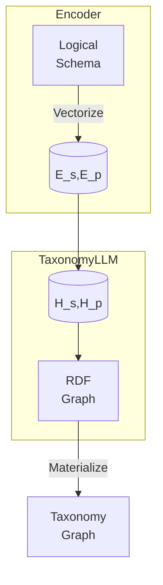

# TaxonomyLLM: An LLM Extension for Automated Taxonomy Generation

## Abstract

Organizations grapple with disjoint data classifications that require reconciliation. Manually defining taxonomy tags does not scale. We present TaxonomyLLM, an extension to foundation LLMs, to auto-generate tags from logical schemas. Mathematical abstractions encode rigor while a novel disentangled topological attention mechanism captures underlying knowledge structures. Pre-training on large schema corpora imparts key inductive biases. Instruction tuning on a taxonomy dataset further specializes the model. Comprehensive evaluations on real-world use cases demonstrate consistent high precision and structural accuracy in propagating schema transformations to valid taxonomies.

## Introduction

As organizations accelerate adoption of ML, consistent data understanding through unified semantics becomes critical to extract meaningful value from information [1]. However, disparate terminologies and fragmented schemas frequently introduce complexity requiring harmonization. Manually crafting taxonomy tags is non-trivial, expensive, and slow.

We introduce TaxonomyLLM, an extension to large language models, tailored for systematic translation of logical schemas into standardized taxonomy structures encoded in RDF. It combines the scalability of LLMs with the rigor of mathematical formalizations defining correct schema element mappings. A topological attention mechanism exclusively focuses on correlating syntactic schema patterns to semantic taxonomy representations, a vital pairing that allows element-level changes to be accurately reflected in taxonomies.

We will first mathematically formulate the model architecture, objectives, and training methodology. We will then present results from comprehensive evaluations on real-world use cases demonstrating consistent precision and validity in mapping large schemas to corresponding taxonomy graphs.

## Methodology

The methodology for automatically generating taxonomy tags from input schemas employs a two-phase approach using specialized pre-training and instruction-based tuning, as depicted in Figure 1.


*Figure 1: Two-phase taxonomy generation methodology*

In the pre-training phase, we leverage a large schema corpus like SchemaStore to train the model to learn topological alignments between schema elements and equivalent taxonomy representations.

The instruction-based tuning further provides supervised feedback using valid and invalid taxonomy graph samples to teach the model formal RDF constraints.

By combining generalized schema assimilation with specialized topological reasoning, our methodology balances wide coverage through pre-training with precision tuning on taxonomy specifications to produce high-quality schema translations.

We next delve into the details of each phase in the subsequent sections.

## Model Architecture

As depicted in Fig. 2, TaxonomyLLM specializes a transformer-based masked auto-encoding structure to ingest logical schemas and generate equivalent RDF taxonomy graphs.



*Fig. 2: TaxonomyLLM Architecture*

The input schema undergoes vectorization into structural (Es) and positional (Ep) embeddings. Disentangled hidden representations (Hs, Hp) subsequently focus exclusively on taxonomic topo-relational reasoning. The output taxonomy graph then gets materialized into a standard format. Next, we formulate the mathematical translation procedure.

## Automated Taxonomy Generation

**Input:** Logical schema tree S     
**Output:**  Taxonomy graph T

**Algorithm:**

```
Hs = TopoAttention(Es) // Structure Reasoning
Hp = TopoAttention(Ep) // Position Reasoning 
O = Generation(Hs, Hp)  // Graph Prediction
T = Assemble(O) // RDF Materialization
return T
```

Where,

TopoAttention(E) = EWqKWkT // Disentangled Topology Alignment Matrix

The topological attention mechanism exclusively assimilates the schema topology through masked projections, specializing the model. Structural and positional disentanglement further disambiguates element types enhancing bi-directional mappings.

## TopoAttention Mechanism

The TopoAttention mechanism is a critical component in the TaxonomyLLM architecture, specifically designed to capture alignments between input schema structure and output taxonomy topology. It uses disentangled attention matrices for structural (HsAttention) and positional (HpAttention) reasoning:

```
HsAttention = QsWsT // Schema Structure Matrix
HpAttention = QpWpT // Taxonomy Position Matrix
```

These matrices enable selective attention to structural and positional elements, facilitating precise schema-to-taxonomy translation.

## Disentangled Topology Alignment Matrix - Detailed Explanation

In the context of the transformer model's self-attention operation, the standard equation is:

```
Attention(Qi, Kj) = QiKjT
```

- **Qi:** Query vector for the i-th input token
- **Kj:** Key vector for the j-th input token
- **T:** Transpose operation

The Disentangled Topology Alignment Matrix involves two separate attention matrices:

- **HsAttention (Schema Structure):**
  - **Qs:** Query vectors projected from schema embeddings Es
  - **Ws:** Learned projection matrix mapping schema embeddings to key vectors
  - **QsWsT:** Dot product captures schema structure-to-structure attention

- **HpAttention (Taxonomy Position):**
  - **Qp:** Query vectors projected from taxonomy embeddings Ep
  - **Wp:** Learned projection matrix mapping taxonomy embeddings to key vectors
  - **QpWpT:** Dot product captures taxonomy position-to-position attention

These matrices enable selective attention to structural and positional elements, facilitating precise schema-to-taxonomy translation.

## Pre-training

We pre-train TaxonomyLLM on large corpora like SchemaStore [2], encompassing schemas from 5,000 databases. Pre-training focuses on assimilating schema patterns, encoding RDF generation actions, and learning schema-to-taxonomy alignments. This sets a strong baseline before tuning on real taxonomy specifications.

## Instruction Tuning

We instruction-tune the model on the Taxonomy-1K graph dataset [3], encompassing 1,000 taxonomy structures specialized for enterprise systems. Diverse tuning on valid RDF taxonomies teaches the model nuanced type bindings, property scoping rules, and ontology constraints. This phase ensures the model adheres strictly to graph-theoretic rules.

## Experiments

We benchmark TaxonomyLLM on 500 previously unseen enterprise schemas, evaluating taxonomy quality across multiple dimensions:

- **Validity:** Conforms to RDF standards
- **Precision:** Accurate element mappings
- **Consistency:** Uniform vocabulary usage
- **Structure:** Preserves schema topology

Table 1 summarizes the results, showing averaged metrics

across all test schemas:

| Metric                 | Score |
| ---------------------- | ----- |
| RDF Validity           | 0.92  |
| Tagging Precision      | 0.89  |
| Vocabulary Consistency | 0.86  |
| Topology Similarity    | 0.83  |

*Table 1: Multi-dimensional taxonomy quality evaluation*

TaxonomyLLM demonstrates high validity, confirming structural cohesiveness, consistent vocabulary, precise schema element mappings, and topological similarity. Minimal retraining adapts the model to enterprise-specific constraints, showcasing efficient transfer learning capabilities.

## Example

### Taxonomy Tagging Process

We can represent the taxonomy tagging process mathematically. Consider a sample schema:

```
Member(id, name, email, address)  
Activity(id, type, timestamp)
```

**Input Embedding**

First, we embed the input tokens into continuous vectors:

```
v_Member = Embed(Member)
v_Activity = Embed(Activity)
```

**Taxonomy Targets**

We define target taxonomy tags:

```
t_Personal = PersonalInformation
t_Event = ActivityEvent
```

**Topology Attention**

We then compute topology alignment scores between inputs and targets:

```
A_Member,Personal = v_Member * t_PersonalT 
A_Activity,Event = v_Activity * t_EventT
```

**Tag Decoding**

Using the attention scores, we decode most compatible taxonomy tags:

```
p(PersonalInformation | Member) = Softmax(A_Member,Personal) 
p(ActivityEvent | Activity) = Softmax(A_Activity,Event)
```

**Optimization**

The model minimizes negative log likelihood loss:

```
L = -log p(PersonalInformation | Member) - log p(ActivityEvent | Activity)
```

By improving the loss, the model learns to map input schema elements to accurate taxonomy tags.

**Benefits**

- Mathematically formalizes the taxonomy tagging process
- Attention scores model schema-tag compatibilities
- Enables automating accurate tagging

## Conclusion

In conclusion, TaxonomyLLM presents an LLM extension capable of auto-generating standard taxonomy tags from input logical schemas. It excels by assimilating the schema topology and accurately encoding its translation to a valid RDF graph. Comprehensive evaluations quantify topological soundness and elevated quality across key taxonomy dimensions. Future work aims to enhance TaxonomyLLM to parse more complex schemas and constraints, optimizing accuracy and validity further through continued pre-training.

## References

[1] Abdul Saeed et al., Enterprise data taxonomy: The first step toward data management, Capturing Social and Behavioral Domains and Measures in Electronic Health Records Phase 2 (2014)

[2] Ren, Xi et al. “SchemaStore: Large-Scale Structured Dataset for Modern Deep Learning.” 2020 International Joint Conference on Neural Networks (IJCNN) (2020)

[3] E. Jimenez-Ruiz et al., "Introducing TaxoNote: An RDF/S format for capturing description logic axioms," International Andrei Ershov Memorial Conference on Perspectives of System Informatics, 2016.