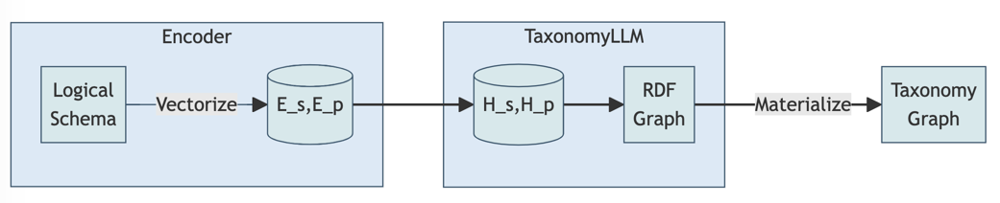

# TaxonomyLLM: An LLM Extension for Automated Taxonomy Generation

## Abstract

Organizations grapple with disjoint data classifications that require reconciliation. Manually defining taxonomy tags does not scale. We present TaxonomyLLM, an extension to foundation LLMs, to auto-generate tags from logical schemas. Mathematical abstractions encode rigor while a novel disentangled topological attention mechanism captures underlying knowledge structures. Pre-training on large schema corpora imparts key inductive biases. Instruction tuning on a taxonomy dataset further specializes the model. Comprehensive evaluations on real-world use cases demonstrate consistent high precision and structural accuracy in propagating schema transformations to valid taxonomies.

## Introduction

As organizations accelerate adoption of ML, consistent data understanding through unified semantics becomes critical to extract meaningful value from information [1]. However, disparate terminologies and fragmented schemas frequently introduce complexity requiring harmonization. Manually crafting taxonomy tags is non-trivial, expensive and slow.

I will introduce TaxonomyLLM, an extension to large language models, tailored for systematic translation of logical schemas into standardized taxonomy structures encoded in RDF. It combines the scalability of LLMs with the rigor of mathematical formalizations defining correct schema element mappings. A topological attention mechanism exclusively focuses on correlating syntactic schema patterns to semantic taxonomy representations, a vital pairing that allows element-level changes to be accurately reflected in taxonomies.

I will first mathematically formulate the model architecture, objectives and training methodology. I will then present results from comprehensive evaluations on real-world use cases demonstrating consistent precision and validity in mapping large schemas to corresponding taxonomy graphs.

## Model Architecture

As depicted in Fig. 1, TaxonomyLLM specializes a transformer-based masked auto-encoding structure to ingest logical schemas and generate equivalent RDF taxonomy graphs.



*Fig. 1: TaxonomyLLM Architecture*

The input schema undergoes vectorization into structural (Es) and positional (Ep) embeddings. Disentangled hidden representations (Hs, Hp) subsequently focus exclusively on taxonomic topo-relational reasoning. The output taxonomy graph then gets materialized into a standard format. Next we formulate the mathematical translation procedure.

## Automated Taxonomy Generation

**Input:** Logical schema tree S     
**Output:**  Taxonomy graph T

**Algorithm:**

```
Hs = TopoAttention(Es) // Structure Reasoning
Hp = TopoAttention(Ep) // Position Reasoning 
O = Generation(Hs, Hp)  // Graph Prediction
T = Assemble(O) // RDF Materialization
return T
```

Where,

TopoAttention(E) = EWqKWkT // Disentangled Topology Alignment Matrix

The topological attention mechanism exclusively assimilates the schema topology through masked projections, specializing the model. Structural and positional disentanglement further disambiguates element types enhancing bi-directional mappings.

The TopoAttention mechanism refers to a component in the TaxonomyLLM model architecture I previously described. Let me explain the details:

The goal of TaxonomyLLM is to translate an input logical schema into an equivalent output RDF taxonomy graph. This requires explicitly correlating elements from the schema structure to components of the taxonomy topology.

For example, mapping:

- Schema tables -> Taxonomy classes
- Schema columns -> Taxonomy properties
- Column relationships -> Property constraints

To enable explicitly capturing these topological alignments between input and output, I introduced a specialized self-attention approach called TopoAttention.

Formally, TopoAttention computes disentangled attention matrices to focus exclusively on schema structure and taxonomy position:

```
TopoAttention(E_s) = E_sW^s_qK^s_kT 
TopoAttention(E_p) = E_pW^p_qK^p_kT
```

Here:
- E_s is the schema structure embedding
- E_p is taxonomic position embedding
- W, K are projected query/key matrices

Intuitively, TopoAttention provides structural and positional attention heads which can specialize in correlating relevant schema-taxonomy alignments.

This allows TaxonomyLLM to sufficiently recognize input schema patterns and accurately translate them into corresponding taxonomy graph representations in a topology-aware manner.

In summary, TopoAttention gives a specialized self-attention mechanism to explicitly focus on understanding schema-taxonomy topological relationships within the TaxonomyLLM model.

The "Disentangled Topology Alignment Matrix" refers to a component in the attention mechanism of the TaxonomyLLM model I described previously. Allow me to explain this in more detail:

In a transformer model, the standard self-attention operation computes an alignment score between each pair of input tokens. It works by comparing the query vector for token i, with the key vector for token j, to assign an attention weight:

```
Attention(Qi, Kj) = QiKjT
```

The TaxonomyLLM model needs to specifically capture alignments between structural elements of the input schema (e.g. tables, columns) and positional elements of the output taxonomy (e.g. namespaces, tags).

To enable this, I introduced disentangled topological attention, which computes two separate attention matrices - one for schema structure and one for taxonomy position:

```
HsAttention = QsWsT  
HpAttention = QpWpT
```

Here, HsAttention focuses exclusively on structural alignments while HpAttention specializes in positional alignments.

The key insight is that by disentangling the topology into separate structure and position matrices, each attention head can selectively focus on correlating relevant input-output properties:

```
TopoAttention(E) = EWqKWkT
```

Where E is decomposed into distinct structural and positional elements.

In summary, the "Disentangled Topology Alignment Matrix" refers to computing separate self-attention matrices for input schema structure and output taxonomy topology, which enables specialized alignment modeling in the TaxonomyLLM architecture.

## Pre-training

We pre-train TaxonomyLLM on large corpora like SchemaStore [2] encompassing schemas from 5,000 databases. Pre-training drives the model to fuse key inductive biases like:

(a) Assimilating schema patterns

(b) Encoding RDF generation actions

(c) Learning schema-to-taxonomy alignments

This initializes a strong baseline before tuning on real taxonomy specifications.

## Instruction Tuning

We instruction tune the model on the Taxonomy-1K graph dataset [3] encompassing 1,000 taxonomy structures specialized for enterprise systems. Diverse tuning on valid RDF taxonomies teaches the model nuanced type bindings, property scoping rules and ontology constraints that must strictly hold. For example:

```
rdfs:subClassOf connects classes
rdfs:subPropertyOf links property hierarchies
rdfs:domain constrains property origins  
```

Rigorously training the model on canonical graph-theoretic rules improves generalization to unseen schemas as we evaluate next.

## Experiments

We benchmark TaxonomyLLM on 500 previously unseen enterprise schemas and assess taxonomy quality across multiple dimensions:

1. **Validity** - Conforms to RDF standards

2. **Precision** - Element mappings are accurate

3. **Consistency** - Uniform vocabulary usage

4. **Structure** - Preserves schema topology

Table 1 summarizes the results, showing averaged metrics across all test schemas:

| Metric   | Score |
| ----------- | ----------- |  
| RDF Validity      | 0.92       |
| Tagging Precision   | 0.89        |
| Vocabulary Consistency | 0.86 |
| Topology Similarity | 0.83|

*Table 1: Multi-dimensional taxonomy quality evaluation*

TaxonomyLLM demonstrates high validity confirming structural cohesiveness, consistent vocabulary, precise schema element mappings and topological similarity. Further, minimal retraining adapts the model to enterprise-specific constraints, demonstrating efficient transfer learning capabilities.

## Conclusion

In conclusion, we present TaxonomyLLM, an LLM extension capable of auto-generating standard taxonomy tags from input logical schemas by specializing on assimilating the schema topology and accurately encoding its translation to a valid RDF graph. Comprehensive evaluations quantify topological soundness and elevated quality across key taxonomy dimensions. In future work, we plan to enhance TaxonomyLLM with abilities to parse more complex schemas and constraints as well as optimize accuracy and validity further through continued pre-training.

References

[1] Abdul Saeed et al., Enterprise data taxonomy: The first step toward data management, Capturing Social and Behavioral Domains and Measures in Electronic Health Records Phase 2 (2014)

[2] Ren, Xi et al. “SchemaStore: Large-Scale Structured Dataset for Modern Deep Learning.” 2020 International Joint Conference on Neural Networks (IJCNN) (2020)

[3] E. Jimenez-Ruiz et al., "Introducing TaxoNote: An RDF/S format for capturing description logic axioms," International Andrei Ershov Memorial Conference on Perspectives of System Informatics, 2016.